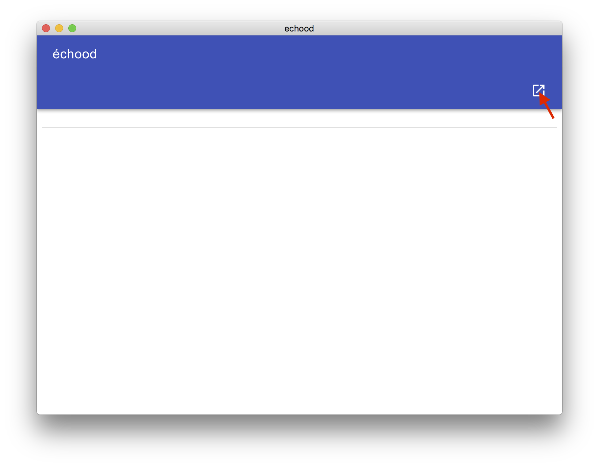
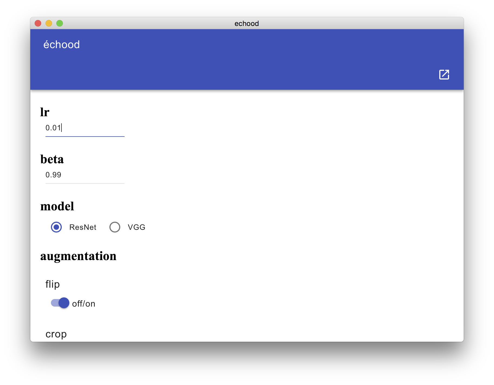
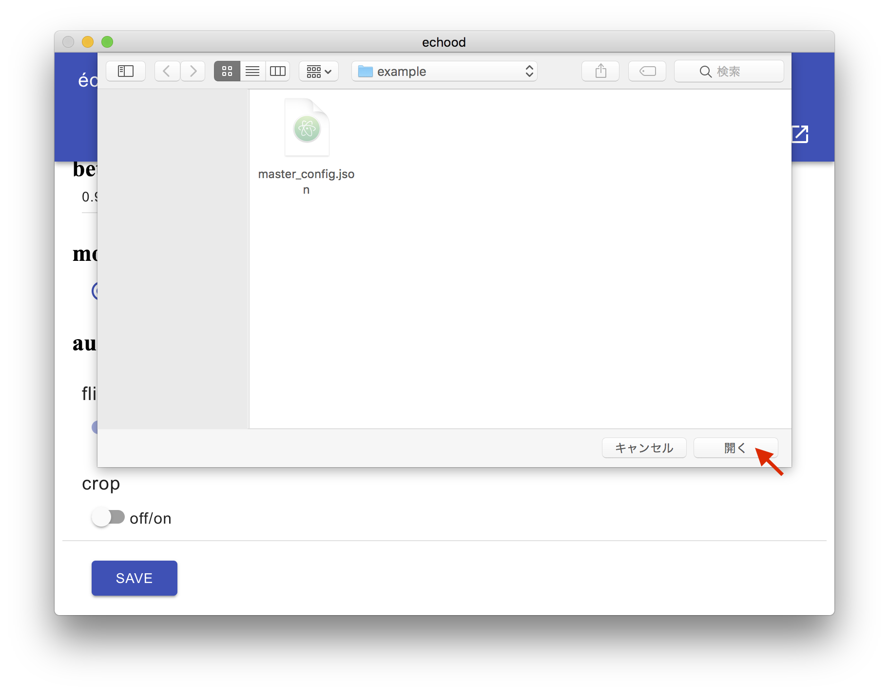
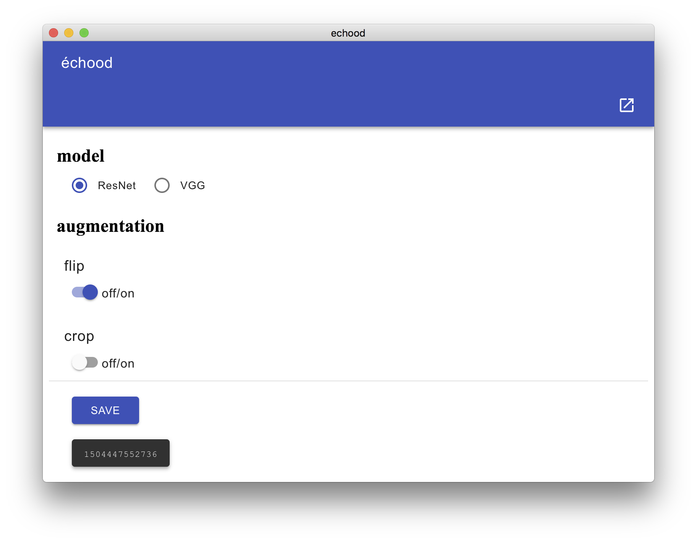

# échood

étood is an electron based GUI assistant tool to configure machine learning settings.

## how to use

étood uses Electron so `node.js` and `npm` are required.

```bash
git clone https://github.com/moskomule/étude.git
npm start
```

1. Push the button right above and load an étood's configuration（[example](example/config/master_config.json)）
    

2. If you need overwrite default values.


3. Push `save` button to specify the output directory. Currently output file name is fixed to `config.json`.


4. An ID of saved configuration will be appeared under `save` button. If you tap it then it's copied to the clipboard.


5. Train/inference with the configuration.
    + example:`python train.py 1504444726784`

### input example

```json
{
    "numerical": {
        "lr": 0.1,
        "beta": 0.99
    },
    "single-choice": {
        "model": ["ResNet", "VGG"]
    },
    "multi-choice": {
        "augmentation": [["flip"], "crop"]
    }
}
```

* currently only `"numerical", "single-choice", "multi-choice"` are supported.
    + In `"numerical"`, the default values are written.
    + You can choose only one element in `"single-choice"`. First one is the default.
    + You can choose multiple elements in `"multi-choice"`. Elements in the first array are default.

### output example(`config.json`)

```json
{
    "1504451138954": {
        "lr": "0.01",
        "beta": "0.99",
        "model": "ResNet",
        "augmentation": ["flip", "crop"]
    }
}
```

## why échood?

This is my first Electron and javascript project, so that this is an étude() for me. Also I thought up this project when I traveled in Toyama prefecture, Japan, which was called Etchū(越中).

## todo

- [ ] check duplicated
- [ ] enable to change output file name
- [ ] add description field to output
- [ ] better UI/code
- [ ] better key for output
