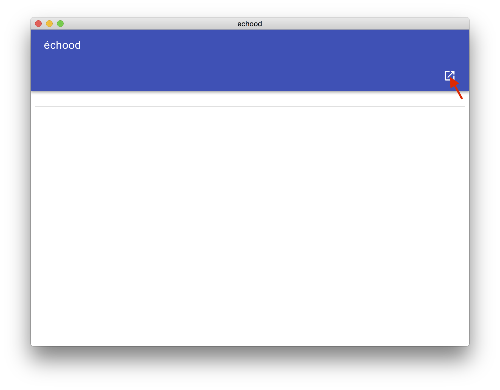
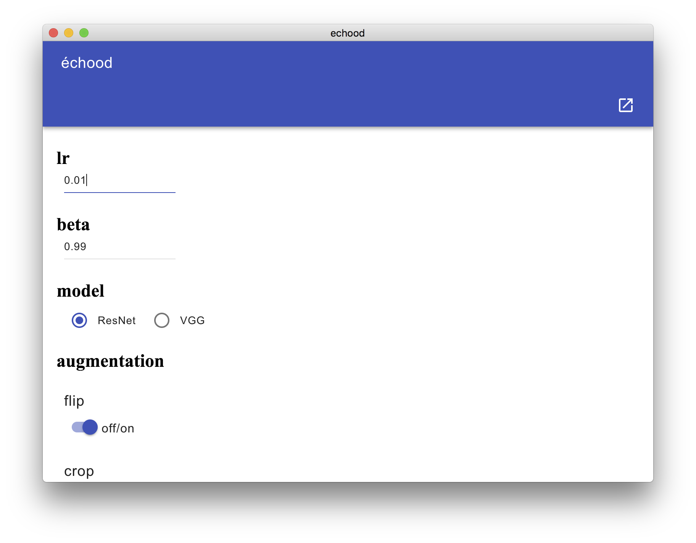
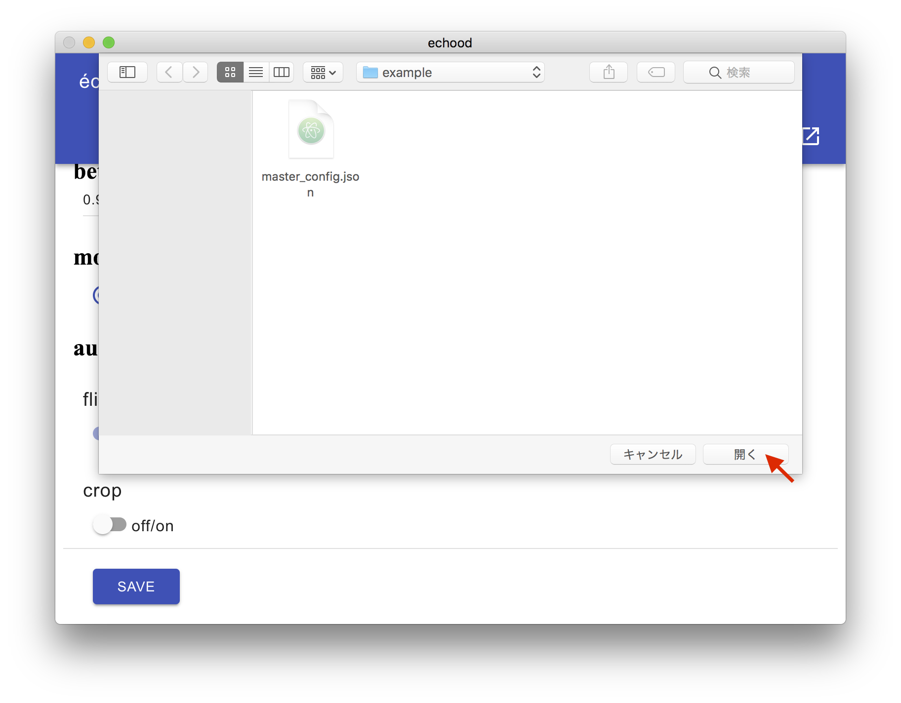

# échood

échoodはelectronベースのGUIによる機械学習の設定ファイル作成支援ソフトです

## 使用方法

échoodはElectronを使用しています

`node.js`と`npm`が必要です

```bash
git clone https://github.com/moskomule/étude.git
npm start
```

1. 右上のボタンを押してétudeの設定ファイルを読み込みます（[例](example/config/master_config.json)）
    

2. 必要があれば値を書き換えます


3. `save`ボタンを押して保存先のディレクトリを指定します(いまのところ保存されるファイル名は固定`config.json`です)


4. `save`ボタンの下に保存した設定のIDが表示されます（タップすることでクリップボードにコピーされます）


5. 出力設定ファイルを用いて学習・推論を行います
    + 例:`python train.py 1504444726784`

### 入力例

```json
{
    "numerical": {
        "lr": 0.1,
        "beta": 0.99
    },
    "single-choice": {
        "model": ["ResNet", "VGG"]
    },
    "multi-choice": {
        "augmentation": [["flip"], "crop"]
    }
}
```

* currently only `"numerical", "single-choice", "multi-choice"` are supported.
    + In `"numerical"`, the default values are written.
    + You can choose only one element in `"single-choice"`. First one is the default.
    + You can choose multiple elements in `"multi-choice"`. Elements in the first array are default.

### 出力例(`config.json`)

```json
{
    "1504451138954": {
        "lr": 0.01,
        "beta": 0.99,
        "model": "ResNet",
        "augmentation": ["flip", "crop"]
    }
}
```

## why échood?

This is my first Electron and javascript project, so that this is an étude() for me. Also I thought up this project when I traveled in Toyama prefecture, Japan, which was called Etchū(越中).

## todo

- [ ] check duplicated
- [ ] enable to change output file name
- [ ] add description field to output
- [ ] better UI/code
- [ ] better key for output
